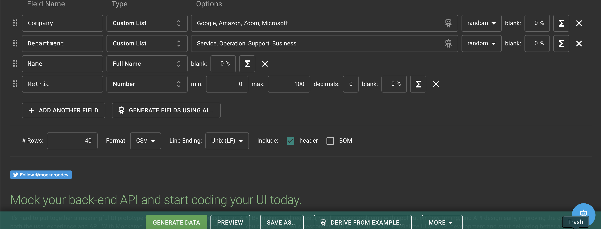

# Extra Credit Assignment: Tree Layout to Force-Directed Graph  

**Name:** Shaily Roy  
**Email:** shailyro@asu.edu  

---

## Overview  

In this extra credit assignment, you will create an interactive dashboard using D3.js that links a **Tree Layout** to a **Force-Directed Graph**. This task will help you practice:

- Parsing and processing hierarchical data.  
- Visualizing hierarchical relationships with a **Tree Layout**.  
- Dynamically generating and visualizing a **Force-Directed Graph** for selected nodes.  
- Adding interactivity with tooltips, transitions, and highlighting.


## Dataset Instructions  
You can create your own dataset which will have Company (String), Department (String), Name (String), Metric (Numeric) or 

To generate your dataset, follow these steps:  

1. **Go to [Mockaroo](https://www.mockaroo.com/).**  

2. **Generate Fields Using AI**:  
   - Click **"Generate Fields Using AI"** and input the following example data (you can customize it if you want):  
     ```
     Company, Department, Name, Metric
     Google, Training, Alex Smith, 45
     Google, Services, John Doe, 80
     Amazon, Training, Mary Jane, 60
     Amazon, Training, Samuel Ross, 90
     Google, Training, Emma Brown, 70
     Google, Services, Rachel Green, 55
     Amazon, Services, Jake White, 85
     ```

3. **Configure Fields**:  
   Mockaroo will auto-detect the types. Then you need to select the Type and customize as per your will:  
   - **Company**: Custom List (values like Amazon, Google).  
   - **Department**: Custom List (e.g., Training, Services, Operations).  
   - **Name**: Full Name.  
   - **Metric**: Number (0–150).
       

4. **Set Rows**: Generate at least 10 number of rows to ensure repetitive `Company` and `Department` values.

5. **Download the File**: Export it as **`data.csv`**.


## Steps to Complete the Assignment  
To complete the assignment
Clone this code template to your local machine.
Start a local server and open the index.html page.
Modify the given code according to the instructions below to achieve the requested interface.
Commit and push the code back to this repository to submit it.

When you first run the page, you should see the empty interface. Add your name and email to the top, and then create a Javascript file to contain all your JS/D3 logic. You should name the file using your ASURITE. For example, Dr. Bryan's JS file would be named cbryan16.js. Link to this file in your index.html.


### Step 1: Load and Transform Data (3 points)  

1. **Load the Dataset**  
   -Load the `csv` file. Each row of the file will become an object with properties: `Company`, `Department`, `Name`, and `Metric`.  
     
#### 2. Transform the Flat Dataset into a Hierarchical Structure  
You need to group the data **hierarchically** as follows:  
- **Company** (Top level) → **Department** (Second level) → Employees (Leaf nodes).  

D3 provides the **`d3.group()`** function to group data easily. Then, use `Array.from()` to convert the grouped data into a structure that can be used for a Tree Layout.

**Output Structure Example:**  
```json
{
  "name": "All Companies",
  "children": [
    {
      "name": "Zoomlounge",
      "children": [
        {
          "name": "Training",
          "children": [
            { "name": "Alex Smith", "value": 45 },
            { "name": "Emma Brown", "value": 70 }
          ]
        },
        {
          "name": "Services",
          "children": [
            { "name": "John Doe", "value": 80 }
          ]
        }
      ]
    },
    {
      "name": "Trilith",
      "children": [
        {
          "name": "Training",
          "children": [
            { "name": "Samuel Ross", "value": 90 }
          ]
        }
      ]
    }
  ]
}
```


### Step 2: Create the Tree Layout (3 points)  

1. **Define the Tree Layout**  
   - Use `d3.hierarchy()` to prepare the hierarchical data for visualization.  
   - Use `d3.tree()` to calculate the positions of nodes and links. The tree layout will arrange nodes in a vertical layout.

2. **Render the Tree Layout**  
   - Draw **links** (lines) between nodes to represent the parent-child relationships.  
   - Draw **nodes** (circles) at the position of companies, departments, and employees.  

3. **Add Node Labels**  
   - Add text labels next to each node to display the `name` property.

4. **Add Interactivity**  
   - **Hover**: Show a tooltip displaying the node’s name and metric (for employees).  
   - **Click**: Add a click event to trigger the Force-Directed Graph.

**Hints:**  
- Use SVG `path` elements to draw links and `circle` elements for nodes.  
- Use the `.on("mouseover")` and `.on("mouseout")` events for tooltips.  
- Use `d3.selectAll()` to select nodes and attach interactivity.

---

### Step 3: Generate the Force-Directed Graph (3 points)  

1. **Set Up the Force-Directed Graph**  
   - Extract all employees under the clicked **Company** or **Department** node in the Tree Layout.  
   - Prepare the **nodes** (employees) and **links** (connections between employees).

2. **Initialize the Simulation**  
   - Use `d3.forceSimulation()` to simulate forces on nodes and links.  
   - Apply the following forces:  
     - **Center force**: Keeps nodes centered in the graph.  
     - **Link force**: Connects nodes with links.  
     - **Collision force**: Prevents overlapping nodes.

3. **Render the Graph**  
   - Draw **nodes** as circles and **links** as lines connecting them.  
   - Position the nodes dynamically based on the force simulation.

4. **Add Interactivity**  
   - **Hover**: Show a tooltip with the employee's name and metric.  
   - **Drag**: Allow nodes to be repositioned interactively by dragging.

**Hints:**  
- Use `d3.forceSimulation()` with forces like `forceCenter`, `forceLink`, and `forceCollide`.  
- Use `d3.drag()` to enable dragging of nodes.  

---

### Step 4: Tooltips and Final Touches (1 point)  

1. **Add Smooth Transitions**  
   - Add transitions to fade in nodes and links in both the Tree Layout and the Force-Directed Graph.

2. **Apply Color Scheme**  
   - Use a unique color for each **Company** and lighter shades for **Departments**.  
   - Apply neutral or gray colors to Employee nodes.

**Hints:**  
- Use D3’s `scaleOrdinal()` to assign colors.  
- Use `transition()` for smooth animations.

---

## Extra Credit (Up to 4 Bonus Points)  

1. **Drag Nodes (+2 points):**  
   - Enable dragging for nodes in the Force-Directed Graph.  
   - Use `d3.drag()` to update node positions dynamically during the simulation.

2. **Highlight Selected Node (+2 points):**  
   - When a node is clicked in the Tree Layout:  
     - Highlight the selected node with a larger border or a unique color.  
     - Reset other nodes to the default style.

**Hints:**  
- Use `.classed()` to apply or remove a CSS class that highlights the node.  

---

## Final Outcome  

Your final dashboard will include:  
1. A **Tree Layout** displaying hierarchical relationships (Company → Department → Employees).  
2. A **Force-Directed Graph** that dynamically visualizes employees under the selected node.  

**Final Screenshot Example:**  
  
  

**GIF Demonstrating Interaction:**  
  

---

## Grading Breakdown  

| Step                       | Points |  
|----------------------------|--------|  
| Step 1: Data Loading       | 3      |  
| Step 2: Tree Layout        | 3      |  
| Step 3: Force-Directed Graph | 3      |  
| Step 4: Tooltips & Transitions | 1      |  
| **Extra Credit**           | 4      |  
